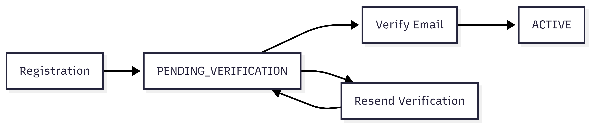

# FR-AUTH-002

Feature ID: AUTH-001
Module: AUTH
Priority: Must Have
Requirement Name: Email Verification
Requirement Type: System
Status: Implemented
Version: MVP

# FR-AUTH-002 - Email Verification

## Requirement Information

| Item | Value |
| --- | --- |
| **Requirement ID** | FR-AUTH-002 |
| **Feature ID** | AUTH-001 |
| **Module** | Authentication |
| **Requirement Name** | Email Verification |
| **Requirement Type** | System Requirement |
| **Priority** | Must Have |
| **Version** | MVP |
| **Status** | Implemented |

## Overview

This requirement defines the process of verifying a user's email address after successful registration.

Email verification ensures that the email address associated with a newly registered account is valid and owned by the user before the account is activated.

## Description

The system shall verify a user's email address using a verification token delivered through email.

After successful verification, the user's account status changes from `PENDING_VERIFICATION` to `ACTIVE`.

The verification token is marked as used and cannot be used again.

## Actors

| Actor | Role |
| --- | --- |
| **Customer** | Opens the verification link received through email. |
| **System** | Validates the verification token and activates the user account. |

## Preconditions

- The user has successfully registered an account.
- The user's account status is `PENDING_VERIFICATION`.
- A verification token has been generated for the user.
- The verification token has not expired.
- The verification token has not been used.
- The system can access the database.

## Trigger

The customer opens the email verification link containing the verification token.

## Main Flow

1. The customer opens the verification email.
2. The customer selects the **Verify Email** link.
3. The system receives the verification token.
4. The system locates the corresponding verification token.
5. The system validates the verification token.
6. The system verifies that the token has not expired.
7. The system verifies that the token has not been used.
8. The system retrieves the associated user.
9. The system verifies that the user's account status is `PENDING_VERIFICATION`.
10. The system changes the user's account status to `ACTIVE`.
11. The system records the email verification timestamp.
12. The system marks the verification token as used.
13. The system returns a successful verification response.
14. The customer can proceed to the login flow.

## Alternative Flow

### A1 — Invalid Verification Token

- The system cannot find a valid verification token matching the supplied credential.
- Verification is rejected.
- The system returns an appropriate error response.

### A2 — Expired Verification Token

- The system determines that the verification token has expired.
- Verification is rejected.
- The user account remains in `PENDING_VERIFICATION`.
- The customer can request a new verification email.

### A3 — Verification Token Already Used

- The system determines that the verification token has already been used.
- Verification is rejected.
- The system does not modify the user account.

### A4 — Account Already Active

- The associated user already has an `ACTIVE` account status.
- The system does not perform another activation.
- The system returns an appropriate response indicating that the account has already been verified.

### A5 — Associated User Not Found

- The verification token references a user that cannot be found.
- Verification is rejected.
- The account cannot be activated.

## Postconditions

### If Successful

- The user's account status becomes `ACTIVE`.
- `email_verified_at` is populated.
- The verification token is marked as used.
- The verification token cannot be reused.
- The user can log in.

### If Verification Fails

- The user's account status remains unchanged.
- No account activation occurs.
- An expired or used verification token cannot be reused.

## Business Rules

| Rule ID | Rule |
| --- | --- |
| **BR-AUTH-006** | A newly registered account must complete email verification before becoming `ACTIVE`. |
| **BR-AUTH-007** | A verification token can only be used once. |
| **BR-AUTH-008** | A verification token must have an expiration time. |
| **BR-AUTH-009** | Successful verification changes the account status from `PENDING_VERIFICATION` to `ACTIVE`. |
| **BR-AUTH-010** | A customer may request another verification email when the current verification token is expired or no longer usable. |

## Validation Rules

| Field | Validation |
| --- | --- |
| **Verification Token** | Required and must correspond to a valid stored verification credential. |
| **Token Expiration** | The token must not have expired. |
| **Token Usage** | `used_at` must be `null`. |
| **User Account Status** | The account must not already be `ACTIVE`. |
| **Associated User** | The referenced user must exist. |

## Acceptance Criteria

- The customer can verify their email using a valid verification link.
- An invalid verification token is rejected.
- An expired verification token is rejected.
- A used verification token cannot be reused.
- A `PENDING_VERIFICATION` account becomes `ACTIVE` after successful verification.
- The email verification timestamp is recorded after successful verification.
- The verification token is marked as used after successful verification.
- A successfully verified customer can log in.
- The customer can request a new verification email when necessary.

## Related Features

- **AUTH-001 — User Registration**
- **AUTH-002 — User Login** *(downstream dependency)*

## Related Database Tables

- `users`
- `verification_tokens`

## Related API Endpoints

| Method | Endpoint |
| --- | --- |
| **GET** | `/auth/verify-email` |
| **POST** | `/auth/verify-email/resend` |

## UI Reference

- Email Verification Notice
- Email Verification Success
- Email Verification Failed
- Resend Verification Email

## Notes

- Verification tokens must be generated using cryptographically secure random values.
- Verification token credentials must be unguessable.
- Token values stored in the database must follow the authentication security design.
- Used or expired verification tokens must not be accepted.
- Email verification is required before the account can transition to `ACTIVE`.
- Failure to deliver a verification email must not activate the account.

## Lifecycle

