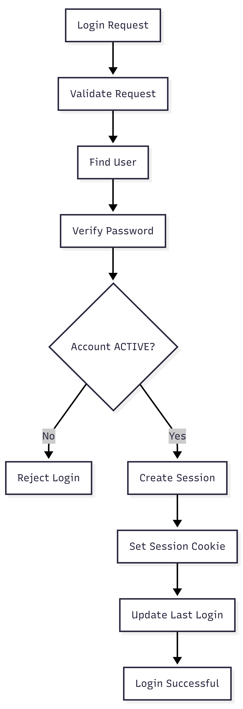

# FR-AUTH-003

Feature ID: AUTH-002
Module: AUTH
Priority: Must Have
Requirement Name: User Login
Requirement Type: User
Status: Implemented
Version: MVP

# FR-AUTH-003 — User Login

## Requirement Information

| Item | Value |
| --- | --- |
| **Requirement ID** | FR-AUTH-003 |
| **Feature ID** | AUTH-002 |
| **Module** | Authentication |
| **Requirement Name** | User Login |
| **Requirement Type** | User Requirement |
| **Priority** | Must Have |
| **Version** | MVP |
| **Status** | Implemented |

## Overview

This requirement defines the user login process for **Ruma** using a registered email address and password.

## Description

The system shall provide an authentication mechanism that allows registered users to access the application using valid credentials.

The system shall validate the email and password, verify the account status, and establish an authenticated session when authentication is successful.

## Actors

| Actor | Role |
| --- | --- |
| **Customer** | Enters their email address and password to log in. |
| **System** | Validates credentials, verifies account status, and establishes the user's authentication session. |

## Preconditions

- The user has a registered account.
- The user's email address is registered.
- The user's email has been verified.
- The system can connect to the database.
- The authentication system is available.

## Trigger

The customer selects **Login** after entering their email address and password.

## Main Flow

1. The customer opens the Login page.
2. The system displays the login form.
3. The customer enters:
    - Email address
    - Password
4. The customer selects **Login**.
5. The system validates the request data.
6. The system normalizes the submitted email address.
7. The system searches for the user account using the normalized email address.
8. The system validates the password against the stored password hash.
9. The system checks the user's account status.
10. If all validations succeed, the system creates an authentication session.
11. The system stores the session securely.
12. The system sends the session credential to the client through the authentication cookie.
13. The system updates the user's `lastLoginAt` timestamp.
14. The system returns a successful login response.
15. The customer can access resources that require authentication.

## Alternative Flow

### A1 — Email Not Registered

- The system cannot find a user account associated with the submitted email.
- The system rejects the login request.
- The system returns a generic credential error.

Example:

```
Invalid email or password.
```

### A2 — Incorrect Password

- The system finds the user account.
- The submitted password does not match the stored password hash.
- The system rejects the login request.
- The system returns a generic credential error.

Example:

```
Invalid email or password.
```

### A3 — Account Not Verified

- The system finds the user account.
- The account status is `PENDING_VERIFICATION`.
- The system rejects the login request.
- The system asks the customer to verify their email first.

Example:

```
Please verify your email before logging in.
```

### A4 — Account Not Active

- The system detects that the account cannot be used for authentication.
- The system rejects the login request.
- The system returns an appropriate error response.

### A5 — Invalid Login Data

- The request fails validation.
- The system rejects the request.
- The system returns a validation error.
- The customer must correct the submitted data.

## Postconditions

### If Successful

- The customer is authenticated.
- A new session is created.
- The session credential is issued through the authentication cookie.
- The user's `lastLoginAt` value is updated.
- The customer can access protected resources.

### If Failed

- No new authenticated session is established.
- The customer remains unauthenticated.
- The user's password is not changed.

## Business Rules

| Rule ID | Rule |
| --- | --- |
| **BR-AUTH-011** | Login can only be performed using a registered account. |
| **BR-AUTH-012** | The submitted password must be validated against the stored password hash. |
| **BR-AUTH-013** | The user account must be `ACTIVE` before authentication can succeed. |
| **BR-AUTH-014** | The system must create a session after successful authentication. |
| **BR-AUTH-015** | Session credentials must not be stored as plain-text password data. |
| **BR-AUTH-016** | The system must update `lastLoginAt` after a successful login. |
| **BR-AUTH-017** | Authentication failures should not disclose whether an email address is registered. |

## Validation Rules

| Field | Validation |
| --- | --- |
| **Email** | Required and must use a valid email format. |
| **Password** | Required and must contain at least 8 characters. |

## Acceptance Criteria

- The customer can log in using valid email and password credentials.
- An email address that is not registered is rejected.
- An incorrect password is rejected.
- A `PENDING_VERIFICATION` account cannot log in successfully.
- Passwords are validated against the stored password hash.
- A secure authentication session is created after successful login.
- The session credential is issued to the client through the authentication cookie.
- `lastLoginAt` is updated after successful login.
- The authenticated user can access protected endpoints after successful login.
- Passwords and password hashes are not returned in the response.
- Authentication failures do not expose whether the submitted email is registered.

## Related Feature

- **AUTH-002 — User Login**

## Related Functional Requirements

- **FR-AUTH-004 — Credential Validation**
- **FR-AUTH-005 — Authenticate User Session**
- **FR-AUTH-006 — Maintain User Authentication**
- **FR-AUTH-007 — Establish User Session**

## Related Database Tables

- `users`
- `sessions`

## Related API Endpoints

| Method | Endpoint |
| --- | --- |
| **POST** | `/auth/login` |
| **GET** | `/auth/me` |

## UI Reference

- Login Page
- Login Error State
- Login Success / Redirect
- Authentication Loading State

## Notes

- Passwords must never be returned through the API.
- Password verification must use the password hashing mechanism implemented by the system.
- Authentication sessions must have an expiration time.
- Expired or revoked sessions must not provide access to protected resources.
- The system uses session-based authentication rather than JWT access tokens.

## Login Flow

