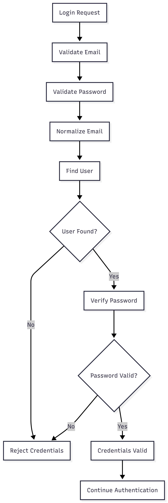

# FR-AUTH-004

Feature ID: AUTH-002
Module: AUTH
Priority: Must Have
Requirement Name: Credential Validation
Requirement Type: System
Status: Implemented
Version: MVP

# FR-AUTH-004 — Credential Validation

## Requirement Information

| Item | Value |
| --- | --- |
| **Requirement ID** | FR-AUTH-004 |
| **Feature ID** | AUTH-002 |
| **Module** | Authentication |
| **Requirement Name** | Credential Validation |
| **Requirement Type** | System Requirement |
| **Priority** | Must Have |
| **Version** | MVP |
| **Status** | Implemented |

## Overview

This requirement defines the credential validation process performed during user login.

The system must verify that the submitted email address and password correspond to valid account credentials before authentication can continue.

## Description

The system shall validate login credentials by locating the user account using the submitted email address and verifying the submitted password against the stored password hash.

Passwords must not be stored or compared in plain text.

Credential validation must be completed before an authentication session is established.

## Actors

| Actor | Role |
| --- | --- |
| **Customer** | Provides email and password credentials during login. |
| **System** | Validates the email address, locates the account, and verifies the password. |

## Preconditions

- The login request contains an email address and password.
- The system can access the user database.
- User passwords are stored as secure hashes.
- The customer is performing a login operation.

## Trigger

The customer submits login credentials through the Login form.

## Main Flow

1. The system receives the email address and password from the login request.
2. The system validates the email format.
3. The system validates the password requirements.
4. The system normalizes the email address.
5. The system searches for the user account using the normalized email address.
6. The system checks whether the account exists.
7. The system retrieves the stored password hash.
8. The system verifies the submitted password against the stored password hash.
9. The system determines whether the credentials are valid.
10. If the credentials are valid, the login process continues to session authentication.
11. If the credentials are invalid, the system rejects the login attempt.

## Alternative Flow

### A1 — User Account Not Found

- The system cannot find an account associated with the submitted email.
- Credential validation fails.
- The system rejects the login attempt.
- The system returns a generic authentication error.

Example:

```
Invalid email or password.
```

### A2 — Password Does Not Match

- The system finds the user account.
- The submitted password does not match the stored password hash.
- Credential validation fails.
- The system rejects the login attempt.
- No new session is created.

### A3 — Invalid Email Format

- The system detects an invalid email format.
- The request is rejected.
- The system returns a validation error.

### A4 — Password Does Not Meet Validation Requirements

- The system detects that the submitted password does not satisfy the minimum requirements.
- The request is rejected.
- The system returns a validation error.

### A5 — User Account Cannot Be Used

- The system determines that the account cannot proceed with authentication.
- Credential validation or subsequent authentication is rejected.
- No authenticated session is established.

## Postconditions

### If Successful

- The submitted credentials are considered valid.
- The login process can continue to session authentication.
- The system may establish a session through the subsequent authentication flow.

### If Failed

- The credentials are considered invalid.
- No new authentication session is created.
- The user's password is not modified.
- The system does not expose sensitive credential information.

## Business Rules

| Rule ID | Rule |
| --- | --- |
| **BR-AUTH-017** | The user's email address is used as the account identifier during credential lookup. |
| **BR-AUTH-018** | The submitted password must be verified against the stored password hash. |
| **BR-AUTH-019** | Passwords must not be stored or compared in plain text. |
| **BR-AUTH-020** | Invalid credentials must not result in the creation of a new authentication session. |
| **BR-AUTH-021** | Passwords and password hashes must never be exposed to the client. |
| **BR-AUTH-022** | Credential validation must occur before authentication session establishment. |
| **BR-AUTH-023** | Email input must be normalized before account lookup. |

## Validation Rules

| Field | Validation |
| --- | --- |
| **Email** | Required and must use a valid email format. |
| **Password** | Required and must contain at least 8 characters. |

## Acceptance Criteria

- The system can locate a user account using a valid email address.
- The submitted password is verified against the stored password hash.
- A correct password passes credential validation.
- An incorrect password fails credential validation.
- An email address that is not registered fails credential validation.
- An invalid email format is rejected.
- A password that does not meet the minimum requirements is rejected.
- Failed credential validation does not create an authentication session.
- Passwords and password hashes are not included in API responses.
- Valid credentials can proceed to the session authentication process.
- Authentication errors do not unnecessarily disclose whether an email address is registered.

## Related Features

- **AUTH-002 — User Login**

## Related Functional Requirements

- **FR-AUTH-003 — User Login**
- **FR-AUTH-005 — Authenticate User Session**
- **FR-AUTH-006 — Maintain User Authentication**
- **FR-AUTH-007 — Establish User Session**

## Related Database Tables

- `users`

## Related API Endpoints

| Method | Endpoint |
| --- | --- |
| **POST** | `/auth/login` |

## UI Reference

- Login Page
- Invalid Credentials State
- Validation Error State

## Notes

- Password verification must use the password hashing mechanism implemented by the system.
- Password hashes must never be returned through the API.
- Authentication errors should use sufficiently generic messaging to reduce account enumeration risk.
- Credential validation is a prerequisite for session establishment.
- Account status validation is handled as part of the broader login/authentication flow.

## Credential Validation Flow

