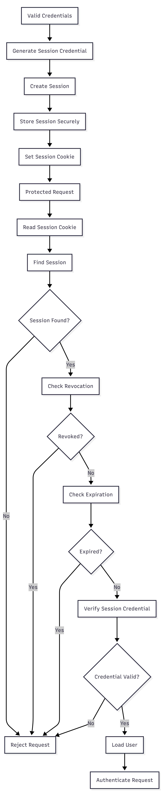

# FR-AUTH-005

Feature ID: AUTH-002
Module: AUTH
Priority: Must Have
Requirement Name: Authenticate User Session
Requirement Type: System
Status: Implemented
Version: MVP

# FR-AUTH-005 — Authenticate User Session

## Requirement Information

| Item | Value |
| --- | --- |
| **Requirement ID** | FR-AUTH-005 |
| **Feature ID** | AUTH-002 |
| **Module** | Authentication |
| **Requirement Name** | Authenticate User Session |
| **Requirement Type** | System Requirement |
| **Priority** | Must Have |
| **Version** | MVP |
| **Status** | Implemented |

## Overview

This requirement defines how Ruma authenticates a user through a valid session after successful credential validation.

The system must establish a secure session associated with the authenticated user and use that session to authenticate subsequent requests to protected resources.

## Description

After the user's credentials have been successfully validated, the system shall create an authentication session associated with the corresponding user.

The session credential shall be delivered to the client through an authentication cookie.

For subsequent protected requests, the system shall retrieve the session credential from the cookie, locate the corresponding session, validate the credential, and verify that the session remains active before allowing access.

## Actors

| Actor | Role |
| --- | --- |
| **Customer** | Accesses protected resources after successfully logging in. |
| **System** | Creates, stores, and validates the customer's authentication session. |

## Preconditions

- The user has a registered account.
- The user's credentials have been successfully validated.
- The account is allowed to authenticate.
- The system can access the database.
- The system can create and validate authentication sessions.

## Trigger

The user successfully completes login with valid credentials.

## Main Flow

1. The system receives the result of successful credential validation.
2. The system generates a cryptographically secure session credential.
3. The system derives the session lookup value from the credential.
4. The system securely hashes the session credential for persistent storage.
5. The system creates a new session record.
6. The system associates the session with the authenticated user's `userId`.
7. The system sets the session expiration time.
8. The system sends the session credential to the client through the authentication cookie.
9. The client stores the session cookie according to browser cookie rules.
10. The client sends the session cookie with subsequent protected requests.
11. The system extracts the session credential from the request cookie.
12. The system derives the session lookup value from the supplied credential.
13. The system locates the corresponding session.
14. The system verifies that the session has not been revoked.
15. The system verifies that the session has not expired.
16. The system verifies the supplied credential against the stored session credential hash.
17. The system retrieves the user associated with the session.
18. The system authenticates the request.
19. The protected resource is allowed to continue processing.

## Alternative Flow

### A1 — Session Not Found

- The system cannot find a session matching the supplied session credential.
- Authentication fails.
- The protected request is rejected.
- The user is treated as unauthenticated.

### A2 — Session Credential Not Available

- The request does not contain the required session cookie.
- The system cannot authenticate the request.
- The protected request is rejected.
- The user must log in before accessing the protected resource.

### A3 — Session Expired

- The system finds the corresponding session.
- `expiresAt` has passed.
- The system treats the session as invalid.
- The protected request is rejected.
- The user must authenticate again or use the session refresh flow when eligible.

### A4 — Session Revoked

- The system finds the corresponding session.
- `revokedAt` is not `null`.
- The system treats the session as invalid.
- The protected request is rejected.

### A5 — Session Credential Verification Failed

- The system finds a session using the derived lookup value.
- The supplied credential does not match the stored `tokenHash`.
- The system rejects the authentication attempt.
- The protected request is rejected.

### A6 — Associated User Not Found

- The session is found and otherwise valid.
- The associated user cannot be found.
- The system cannot authenticate the request.
- The protected request is rejected.

## Postconditions

### If Successful

- A valid authentication session exists.
- The session is associated with the authenticated user.
- The client possesses the session credential through the authentication cookie.
- Subsequent requests containing the valid session can be authenticated.
- The system can identify the authenticated user.

### If Failed

- The protected request is rejected.
- The user is treated as unauthenticated.
- No protected resource is returned.
- An invalid session does not grant access.

## Business Rules

| Rule ID | Rule |
| --- | --- |
| **BR-AUTH-023** | Every authentication session must be associated with a valid user. |
| **BR-AUTH-024** | Session credentials must be generated using cryptographically secure random values. |
| **BR-AUTH-025** | Raw session credentials must not be stored in the database. |
| **BR-AUTH-026** | Every session must have an expiration time. |
| **BR-AUTH-027** | Expired sessions must not authenticate protected requests. |
| **BR-AUTH-028** | Revoked sessions must not authenticate protected requests. |
| **BR-AUTH-029** | Protected requests must provide a valid authentication session. |
| **BR-AUTH-030** | Session credentials must be delivered through the authentication cookie. |
| **BR-AUTH-031** | The supplied session credential must be verified against the stored session credential hash. |
| **BR-AUTH-032** | Session lookup and credential verification must both succeed before a protected request is authenticated. |

## Validation Rules

| Field | Validation |
| --- | --- |
| **Session Cookie** | Must be present for protected requests. |
| **Session Credential** | Must correspond to a stored session lookup and pass credential verification. |
| **Session Expiration** | `expiresAt` must be greater than the current time. |
| **Session Revocation** | `revokedAt` must be `null`. |
| **User** | The user associated with the session must exist. |

## Acceptance Criteria

- A session is created after successful credential validation.
- The session is associated with the authenticated user's `userId`.
- A cryptographically secure session credential is generated.
- The raw session credential is not stored in the database.
- The session credential is delivered through the authentication cookie.
- A protected request containing a valid session is authenticated successfully.
- The system can identify the authenticated user from the valid session.
- A request without a session cookie is rejected.
- A request with an invalid session credential is rejected.
- An expired session is rejected.
- A revoked session is rejected.
- A session associated with a missing user is rejected.
- A valid session does not expose the stored session credential or its hash to the client.

## Related Features

- **AUTH-002 — User Login**
- **AUTH-003 — User Logout**

## Related Functional Requirements

- **FR-AUTH-003 — User Login**
- **FR-AUTH-004 — Credential Validation**
- **FR-AUTH-006 — Maintain User Authentication**
- **FR-AUTH-007 — Establish User Session**
- **FR-AUTH-009 — Destroy User Session**

## Related Database Tables

- `users`
- `sessions`

## Related API Endpoints

| Method | Endpoint |
| --- | --- |
| **POST** | `/auth/login` |
| **GET** | `/auth/me` |
| **POST** | `/auth/logout` |

## UI Reference

- Login Page
- Authenticated User Page
- Unauthorized State
- Session Expired State

## Notes

- Ruma uses session-based authentication rather than JWT access tokens.
- The session credential is delivered through an HTTP cookie.
- Session credentials must be stored securely.
- Session validation must occur before protected resources are accessed.
- Expired and revoked sessions must never be accepted.
- Session authentication is distinct from credential validation: credential validation confirms the login credentials, while session authentication validates the established session on subsequent requests.

## Session Authentication Flow

