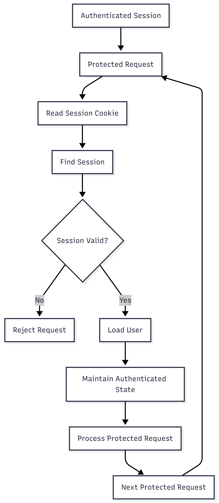

# FR-AUTH-006

Feature ID: AUTH-002
Module: AUTH
Priority: Must Have
Requirement Name: Maintain User Authentication
Requirement Type: System
Status: Implemented
Version: MVP

# FR-AUTH-006 - Maintain User Authentication

## 

## Requirement Information

| Item | Value |
| --- | --- |
| **Requirement ID** | FR-AUTH-006 |
| **Feature ID** | AUTH-002 |
| **Module** | Authentication |
| **Requirement Name** | Maintain User Authentication |
| **Requirement Type** | System Requirement |
| **Priority** | Must Have |
| **Version** | MVP |
| **Status** | Implemented |

## Overview

This requirement defines how Ruma maintains a user's authenticated state after successful login.

As long as the user's authentication session remains valid and has not been revoked, the system shall allow the user to continue accessing protected resources without requiring the user to log in again for every request.

## Description

After a successful login and session establishment, the client sends the session cookie with subsequent requests to protected resources.

The system shall validate the session associated with the request, verify that the session remains active, and identify the user associated with the session.

The user's authenticated state shall remain valid while the session has not expired, has not been revoked, and the associated user remains available.

## Actors

| Actor | Role |
| --- | --- |
| **Customer** | Uses protected application resources without repeatedly logging in while the session remains valid. |
| **System** | Maintains and validates the customer's authentication state across protected requests. |

## Preconditions

- The customer has successfully logged in.
- An authentication session has been established.
- The session credential has been provided to the client through the authentication cookie.
- The session has not expired.
- The session has not been revoked.
- The user associated with the session still exists.
- The authentication system is available.

## Trigger

The customer sends a request to a protected resource after successfully logging in.

## Main Flow

1. The customer successfully completes the login process.
2. The system establishes an authentication session.
3. The system provides the session credential through the authentication cookie.
4. The client retains the session cookie.
5. The customer sends a subsequent request to a protected resource.
6. The client sends the session cookie with the request.
7. The system extracts the session credential from the request.
8. The system derives the session lookup value from the supplied credential.
9. The system retrieves the corresponding session.
10. The system verifies that the session has not been revoked.
11. The system verifies that the session has not expired.
12. The system verifies the supplied session credential against the stored session credential hash.
13. The system retrieves the associated user.
14. The system maintains the user in an authenticated state.
15. The system allows the protected request to continue.
16. The process is repeated for subsequent protected requests while the session remains valid.

## Alternative Flow

### A1 — Session Cookie Not Available

- The request does not contain the required session cookie.
- The system cannot maintain the user's authenticated state.
- The protected request is rejected.
- The user must authenticate again when required.

### A2 — Session Expired

- The system locates the session.
- The session `expiresAt` has passed.
- The system treats the session as invalid.
- The protected request is rejected.
- The user must authenticate again unless an eligible session refresh is performed.

### A3 — Session Revoked

- The system locates the session.
- The session `revokedAt` is not `null`.
- The system treats the session as invalid.
- The protected request is rejected.

### A4 — Associated User Not Found

- The session is found.
- The associated user cannot be found.
- The system cannot maintain authentication.
- The protected request is rejected.

### A5 — Session Credential Invalid

- The system finds the session using the derived lookup value.
- The supplied credential does not match the stored session credential hash.
- The system rejects the request.
- The user is treated as unauthenticated.

## Postconditions

### If Successful

- The user remains authenticated.
- The system can identify the authenticated user.
- The protected request can be processed.
- The customer does not need to log in again while the session remains valid.

### If Failed

- The user is treated as unauthenticated.
- The protected request is rejected.
- No protected resource is returned.
- A new session is not created solely to maintain authentication.

## Business Rules

| Rule ID | Rule |
| --- | --- |
| **BR-AUTH-031** | A user remains authenticated while the associated session remains valid. |
| **BR-AUTH-032** | An expired session must not maintain the user's authenticated state. |
| **BR-AUTH-033** | A revoked session must not maintain the user's authenticated state. |
| **BR-AUTH-034** | Every protected request must be associated with a valid authentication session. |
| **BR-AUTH-035** | An authentication session must reference an existing user. |
| **BR-AUTH-036** | A valid session allows the user to access multiple protected resources without logging in again for each request. |
| **BR-AUTH-037** | The system must not create a new session for every authenticated request when an existing valid session is available. |

## Validation Rules

| Field | Validation |
| --- | --- |
| **Session Cookie** | Must be present for protected requests. |
| **Session Credential** | Must correspond to a valid stored session and pass credential verification. |
| **Session Expiration** | `expiresAt` must be greater than the current time. |
| **Session Revocation** | `revokedAt` must be `null`. |
| **User** | The user associated with the session must exist. |

## Acceptance Criteria

- A customer remains authenticated after successful login.
- The customer can make multiple protected requests without logging in again while the session remains valid.
- The session cookie is sent with subsequent protected requests.
- The system can identify the user from a valid session.
- An expired session causes the authenticated state to become invalid.
- A revoked session causes the authenticated state to become invalid.
- An invalid session credential is rejected.
- A request without a valid session cannot access protected resources.
- The system does not create a new session for every protected request.
- A valid session remains associated with the same user until the session becomes invalid or is rotated.

## Related Features

- **AUTH-002 — User Login**
- **AUTH-003 — User Logout**
- **AUTH-006 — Session Refresh**

## Related Functional Requirements

- **FR-AUTH-003 — User Login**
- **FR-AUTH-004 — Credential Validation**
- **FR-AUTH-005 — Authenticate User Session**
- **FR-AUTH-007 — Establish User Session**
- **FR-AUTH-009 — Destroy User Session**
- **FR-AUTH-013 — Refresh Access Token**

## Related Database Tables

- `users`
- `sessions`

## Related API Endpoints

| Method | Endpoint |
| --- | --- |
| **POST** | `/auth/login` |
| **GET** | `/auth/me` |
| **POST** | `/auth/logout` |
| **POST** | `/auth/refresh` |

## UI Reference

- Authenticated User Page
- Customer Dashboard
- Protected Resource State
- Session Expired / Unauthorized State

## Notes

- Ruma maintains authentication through a server-managed session and session cookie.
- Authentication is not re-established from credentials on every request.
- A valid session can authenticate multiple protected requests.
- Session expiration and revocation invalidate authentication.
- Session refresh is handled separately by FR-AUTH-013.
- Session destruction is handled separately by FR-AUTH-009.

## Authentication Maintenance Flow

