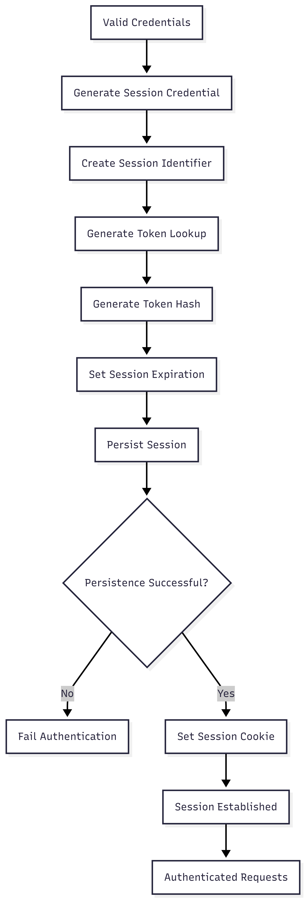

# FR-AUTH-007

Feature ID: AUTH-002
Module: AUTH
Priority: Must Have
Requirement Name: Establish User Session
Requirement Type: System
Status: Implemented
Version: MVP

# FR-AUTH-007 - Establish User Session

## Requirement Information

| Item | Value |
| --- | --- |
| **Requirement ID** | FR-AUTH-007 |
| **Feature ID** | AUTH-002 |
| **Module** | Authentication |
| **Requirement Name** | Establish User Session |
| **Requirement Type** | System Requirement |
| **Priority** | Must Have |
| **Version** | MVP |
| **Status** | Implemented |

## Overview

This requirement defines the process of establishing an authentication session after a user's credentials have been successfully validated.

The system shall create a secure session associated with the authenticated user, persist the session, determine its expiration time, and provide the session credential to the client through an authentication cookie.

## Description

After successful credential validation, Ruma shall establish an authentication session for the authenticated user.

The system shall generate a cryptographically secure session credential, derive a lookup value, securely hash the credential for storage, create the session record, and associate the session with the user's `userId`.

The session credential shall be delivered to the client through an HTTP cookie and used for subsequent authenticated requests.

## Actors

| Actor | Role |
| --- | --- |
| **Customer** | Completes login successfully and receives an authenticated session. |
| **System** | Creates, stores, and establishes the authentication session. |

## Preconditions

- The user has a registered account.
- The user's credentials have been successfully validated.
- The user account is permitted to authenticate.
- The system can access the database.
- The system can generate secure random values.

## Trigger

The system successfully completes credential validation during the login process.

## Main Flow

1. The system receives a successful credential validation result.
2. The system generates a cryptographically secure random session credential.
3. The system generates a unique session identifier.
4. The system derives `tokenLookup` from the session credential.
5. The system generates `tokenHash` from the session credential.
6. The system determines the session expiration time based on the configured session TTL.
7. The system creates a new session record.
8. The system associates the session with the authenticated user's `userId`.
9. The system stores the session in the database.
10. The system sends the raw session credential to the client through the `session` cookie.
11. The session cookie is configured with the required security attributes.
12. The client can send the session cookie with subsequent protected requests.
13. The established session can be validated by the authentication system.

## Alternative Flow

### A1 — Session Credential Generation Fails

- The system cannot generate a secure session credential.
- The session is not established.
- No session credential is sent to the client.
- The login process fails.

### A2 — Session Creation Fails

- The system cannot create the session record.
- No session credential is sent to the client.
- The login process fails.

### A3 — Session Persistence Fails

- The system cannot persist the session to the database.
- The client is not given a session credential for the failed session.
- The authentication process is not completed.

### A4 — Database Unavailable

- The database cannot be accessed.
- The session cannot be persisted.
- The authentication session is not established.
- The login operation fails.

## Postconditions

### If Successful

- A new session record exists.
- The session is associated with the authenticated user.
- The session has a future expiration time.
- The raw session credential is delivered through the authentication cookie.
- The raw session credential is not persisted in the database.
- The user can make authenticated requests using the established session.

### If Failed

- No valid session is established.
- No authentication credential is provided to the client for the failed session.
- The user remains unauthenticated.

## Business Rules

| Rule ID | Rule |
| --- | --- |
| **BR-AUTH-037** | A session may only be established after successful credential validation. |
| **BR-AUTH-038** | Every session must be associated with the user who authenticated. |
| **BR-AUTH-039** | Session credentials must be generated using cryptographically secure random values. |
| **BR-AUTH-040** | Raw session credentials must not be stored in the database. |
| **BR-AUTH-041** | Every session must have an expiration time. |
| **BR-AUTH-042** | The session credential must be delivered to the client through the authentication cookie. |
| **BR-AUTH-043** | The authentication cookie must use appropriate security attributes. |
| **BR-AUTH-044** | A session must not be considered established until it has been successfully persisted. |

## Validation Rules

| Field | Validation |
| --- | --- |
| **User** | Must reference a valid authenticated user. |
| **Session Credential** | Must be generated using a cryptographically secure random source. |
| **Token Lookup** | Must be deterministically derived from the generated session credential. |
| **Token Hash** | Must be a secure hash of the session credential. |
| **Expiration** | `expiresAt` must be in the future. |
| **User ID** | Must reference an existing user. |

## Acceptance Criteria

- A session is established after successful login.
- The session is associated with the authenticated user's `userId`.
- A cryptographically secure session credential is generated.
- `tokenLookup` is generated from the session credential.
- `tokenHash` is securely generated from the session credential.
- The session expiration time is set using the configured TTL.
- The session is persisted before the credential is considered active.
- The raw session credential is not stored in the database.
- The session credential is provided through the `session` cookie.
- The session cookie uses `HttpOnly`.
- The session cookie uses `Secure` in production.
- The established session can be used to authenticate subsequent protected requests.
- Session establishment fails when the session cannot be persisted.

## Related Features

- **AUTH-002 — User Login**
- **AUTH-003 — User Logout**
- **AUTH-006 — Session Refresh**

## Related Functional Requirements

- **FR-AUTH-003 — User Login**
- **FR-AUTH-004 — Credential Validation**
- **FR-AUTH-005 — Authenticate User Session**
- **FR-AUTH-006 — Maintain User Authentication**
- **FR-AUTH-009 — Destroy User Session**
- **FR-AUTH-013 — Refresh Access Token**

## Related Database Tables

- `users`
- `sessions`

## Related API Endpoints

| Method | Endpoint |
| --- | --- |
| **POST** | `/auth/login` |
| **GET** | `/auth/me` |
| **POST** | `/auth/logout` |
| **POST** | `/auth/refresh` |

## UI Reference

- Login Page
- Login Success / Redirect
- Authenticated User Page

## Notes

- Ruma uses session-based authentication rather than JWT access tokens.
- The raw session credential is delivered through the HTTP cookie and is not returned as part of the JSON response.
- The database stores the session lookup value and secure hash rather than the raw session credential.
- Session TTL is configurable through application configuration.
- The authentication cookie must use `HttpOnly`.
- The authentication cookie must use `Secure` in production.
- The session must be successfully persisted before it can be used for authentication.

## Session Establishment Flow

