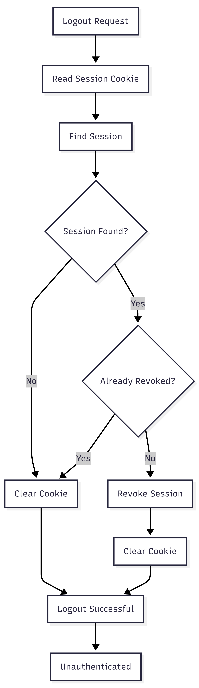

# FR-AUTH-008

Feature ID: AUTH-003
Module: AUTH
Priority: Must Have
Requirement Name: User Logout
Requirement Type: User
Status: Implemented
Version: MVP

# FR-AUTH-008 - User Logout

## Requirement Information

| Item | Value |
| --- | --- |
| **Requirement ID** | FR-AUTH-008 |
| **Feature ID** | AUTH-003 |
| **Module** | Authentication |
| **Requirement Name** | User Logout |
| **Requirement Type** | User Requirement |
| **Priority** | Must Have |
| **Version** | MVP |
| **Status** | Implemented |

## Overview

This requirement defines the user logout process in **Ruma**.

Logout allows an authenticated user to terminate the current authentication session so that the session can no longer be used to access protected resources.

## Description

The system shall provide a logout mechanism that allows an authenticated customer to terminate the current active session.

When logout is successfully processed, the system shall revoke the current session and clear the authentication cookie from the client.

After logout, the user shall no longer be considered authenticated through the revoked session and must authenticate again to obtain a new session.

## Actors

| Actor | Role |
| --- | --- |
| **Customer** | Requests logout from the application. |
| **System** | Identifies and revokes the active session and clears the authentication cookie. |

## Preconditions

- The customer has an authenticated session.
- The session credential is available through the authentication cookie.
- The system can access the database.
- The current session can be identified.

## Trigger

The customer selects **Logout** in the application.

## Main Flow

1. The customer selects **Logout**.
2. The client sends a logout request to the system.
3. The system reads the session credential from the authentication cookie.
4. The system locates the corresponding session.
5. The system validates the session.
6. The system revokes the active session.
7. The system clears the authentication cookie from the client.
8. The system returns a successful logout response.
9. The customer is no longer authenticated through the revoked session.
10. The customer may be redirected to a public page or login page.

## Alternative Flow

### A1 — Session Not Found

- The system cannot find a session corresponding to the supplied credential.
- The system clears the authentication cookie.
- No new session is created.
- The client may treat the user as logged out.

### A2 — Session Already Revoked

- The system finds that the session has already been revoked.
- No additional revocation is required.
- The authentication cookie is cleared.
- The logout operation remains completed without creating a new session.

### A3 — Session Cookie Not Available

- The request does not contain a session cookie.
- The system does not create a new session.
- The client authentication cookie is cleared where applicable.
- The user remains unauthenticated.

### A4 — Session Revocation Fails

- The system cannot update the session state due to an internal or database error.
- The logout operation returns an appropriate error response.
- The cookie-clearing behavior follows the implementation's failure-handling policy.
- No new session is created.

## Postconditions

### If Successful

- The active session is marked as revoked.
- The revoked session cannot authenticate protected requests.
- The authentication cookie is cleared from the client.
- The user is no longer authenticated through the revoked session.
- The user can log in again to establish a new session.

### If Logout Fails

- No new session is created.
- The user may remain authenticated if the session could not be revoked successfully.
- The client may retry the logout operation.

## Business Rules

| Rule ID | Rule |
| --- | --- |
| **BR-AUTH-044** | Logout must revoke the active authentication session. |
| **BR-AUTH-045** | A revoked session must not be accepted for authentication. |
| **BR-AUTH-046** | The authentication cookie must be cleared after logout. |
| **BR-AUTH-047** | Logout must not modify the user's password. |
| **BR-AUTH-048** | Logout must not delete the user's account. |
| **BR-AUTH-049** | A new session must not be created as part of logout. |
| **BR-AUTH-050** | Logout should be idempotent and must not reactivate an existing session. |

## Validation Rules

| Field | Validation |
| --- | --- |
| **Session Cookie** | Used to identify the current authentication session. |
| **Session** | Must correspond to the supplied authentication credential. |
| **Session Status** | An active session may be revoked. |
| **Revoked Status** | An already revoked session must remain revoked. |

## Acceptance Criteria

- An authenticated customer can log out successfully.
- The current session is revoked after logout.
- A revoked session cannot access protected endpoints.
- The authentication cookie is cleared after logout.
- The customer is no longer authenticated through the revoked session.
- The customer can log in again after logout.
- Logout does not delete the user's account.
- Logout does not modify the user's password.
- Logout does not create a new session.
- Logging out an already revoked or unavailable session does not reactivate it.

## Related Features

- **AUTH-002 — User Login**
- **AUTH-003 — User Logout**

## Related Functional Requirements

- **FR-AUTH-005 — Authenticate User Session**
- **FR-AUTH-006 — Maintain User Authentication**
- **FR-AUTH-007 — Establish User Session**
- **FR-AUTH-009 — Destroy User Session**

## Related Database Tables

- `users`
- `sessions`

## Related API Endpoints

| Method | Endpoint |
| --- | --- |
| **POST** | `/auth/logout` |
| **GET** | `/auth/me` |

## UI Reference

- Customer Dashboard
- Logout Button
- Login Page
- Logged-Out State

## Notes

- Ruma uses session-based authentication.
- Logout invalidates the current session by setting `revoked_at`.
- The session record does not need to be physically deleted during logout.
- The authentication guard must reject revoked sessions.
- The cookie must be cleared using cookie attributes consistent with the authentication cookie configuration.
- Logout must not expose sensitive session credentials in the response.
- Logout should be idempotent and must not create or restore an authentication session.

## Logout Flow

