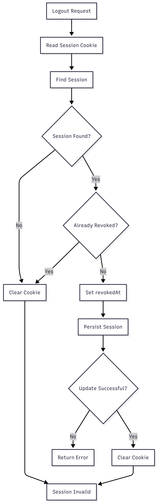

# FR-AUTH-009

Feature ID: AUTH-003
Module: AUTH
Priority: Must Have
Requirement Name: Destroy User Session
Requirement Type: System
Status: Implemented
Version: MVP

# FR-AUTH-009 - Destroy User Session

## Requirement Information

| Item | Value |
| --- | --- |
| **Requirement ID** | FR-AUTH-009 |
| **Feature ID** | AUTH-003 |
| **Module** | Authentication |
| **Requirement Name** | Destroy User Session |
| **Requirement Type** | System Requirement |
| **Priority** | Must Have |
| **Version** | MVP |
| **Status** | Implemented |

## Overview

This requirement defines the system process for terminating an authentication session after a user performs logout.

A session that has been terminated must no longer be accepted for authentication or provide access to protected resources.

## Description

When the logout process is performed, the system shall invalidate the active authentication session associated with the user's session credential.

Ruma uses the `revokedAt` field to indicate that a session has been revoked. The session record does not need to be physically deleted from the database.

Once a session is revoked, subsequent requests using that session must be rejected by the authentication mechanism.

## Actors

| Actor | Role |
| --- | --- |
| **Customer** | Performs logout, which initiates session termination. |
| **System** | Revokes the authentication session and prevents further use of the session. |

## Preconditions

- An authentication session exists.
- The session is associated with a user.
- The session credential is available.
- The session has not already been revoked.
- The system can access the database.

## Trigger

The system receives a logout request containing the current authentication session.

## Main Flow

1. The system receives the logout request.
2. The system retrieves the session credential from the authentication cookie.
3. The system derives the session lookup value from the credential.
4. The system locates the corresponding session.
5. The system validates that the session can be processed.
6. The system records the current time in `revokedAt`.
7. The system persists the session revocation.
8. The system treats the session as invalid.
9. The system clears the authentication cookie from the client.
10. Subsequent requests using the revoked session are rejected.
11. The user must authenticate again to establish a new session.

## Alternative Flow

### A1 — Session Not Found

- The system cannot locate a session matching the supplied credential.
- No new session is created.
- The authentication cookie is cleared where applicable.
- The logout operation does not reactivate or create any session.

### A2 — Session Already Revoked

- The system finds that `revokedAt` is already populated.
- The session remains revoked.
- No additional activation or replacement session is created.
- The authentication cookie is cleared.

### A3 — Session Already Expired

- The system finds the session but its `expiresAt` has passed.
- The session remains invalid.
- The system does not reactivate the session.
- The authentication cookie is cleared.

### A4 — Session Revocation Fails

- The system cannot update the session's `revokedAt` value.
- The session state remains unchanged.
- The system must not treat the session as successfully revoked if persistence fails.
- The system returns an appropriate error response.

## Postconditions

### If Successful

- `revokedAt` contains the session revocation timestamp.
- The session is no longer valid for authentication.
- The revoked session cannot access protected resources.
- The authentication cookie is cleared from the client.
- The user can establish a new session by logging in again.

### If Failed

- The session remains in its previous database state.
- The system does not create a new session.
- The system does not claim successful session destruction when the database update fails.

## Business Rules

| Rule ID | Rule |
| --- | --- |
| **BR-AUTH-050** | An active authentication session must be revocable through the logout process. |
| **BR-AUTH-051** | A revoked session must never be reactivated. |
| **BR-AUTH-052** | A revoked session must be rejected by the authentication mechanism. |
| **BR-AUTH-053** | Session records do not need to be physically deleted when a session is revoked. |
| **BR-AUTH-054** | `revokedAt` records the time at which the session was revoked. |
| **BR-AUTH-055** | A terminated session must not be usable for subsequent authentication. |
| **BR-AUTH-056** | A user must authenticate again to obtain a new session after logout. |
| **BR-AUTH-057** | Session destruction must not create or reactivate an authentication session. |

## Validation Rules

| Field | Validation |
| --- | --- |
| **Session Credential** | Must be available when identifying the current session. |
| **Session** | Must correspond to the supplied credential. |
| **`revokedAt`** | Must be `null` before an active session is revoked. |
| **`expiresAt`** | An expired session must not be reactivated. |
| **User** | The session must reference a valid user when applicable. |

## Acceptance Criteria

- The system can revoke an active user session.
- `revokedAt` is populated when session destruction succeeds.
- A revoked session cannot be used for authentication.
- The authentication mechanism rejects revoked sessions.
- The authentication cookie is cleared after logout.
- A revoked session is never reactivated.
- A user can log in again to obtain a new session.
- The session record may remain in the database after revocation.
- Session destruction does not delete the user account.
- Session destruction does not create a new session.
- Session destruction is idempotent and does not reactivate an already revoked session.

## Related Features

- **AUTH-002 — User Login**
- **AUTH-003 — User Logout**

## Related Functional Requirements

- **FR-AUTH-005 — Authenticate User Session**
- **FR-AUTH-006 — Maintain User Authentication**
- **FR-AUTH-007 — Establish User Session**
- **FR-AUTH-008 — User Logout**

## Related Database Tables

- `sessions`
- `users`

## Related API Endpoints

| Method | Endpoint |
| --- | --- |
| **POST** | `/auth/logout` |
| **GET** | `/auth/me` |

## UI Reference

- Logout Button
- Customer Dashboard
- Login Page
- Unauthorized / Session Expired State

## Notes

- Session records do not need to be physically deleted during logout.
- Ruma uses `revokedAt` to indicate session revocation.
- The authentication mechanism must reject sessions where `revokedAt` is not `null`.
- Expired sessions must not be reactivated.
- The authentication cookie must be cleared after logout.
- Logout must be idempotent.
- Session destruction must not create a new session.

## Session Destruction Flow

