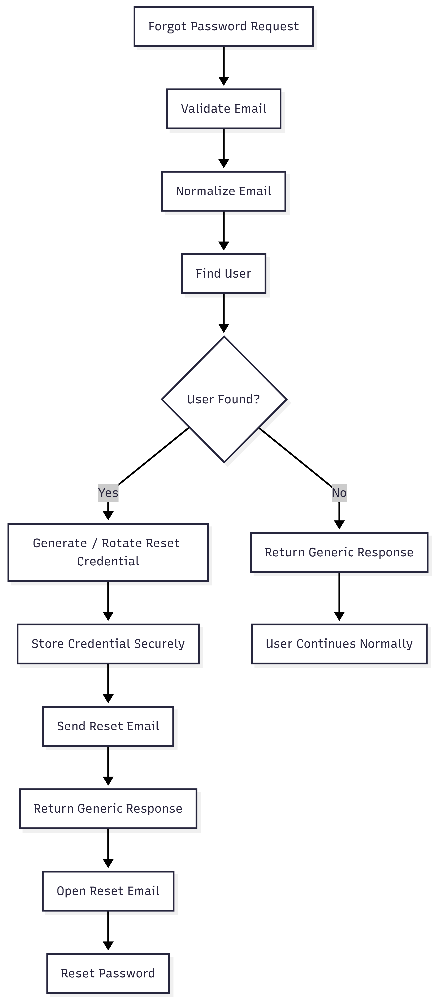

# FR-AUTH-010

Feature ID: AUTH-004
Module: AUTH
Priority: Must Have
Requirement Name: Forgot Password Request
Requirement Type: User
Status: Implemented
Version: MVP

# FR-AUTH-010 — Forgot Password Request

## Requirement Information

| Item | Value |
| --- | --- |
| **Requirement ID** | FR-AUTH-010 |
| **Feature ID** | AUTH-004 |
| **Module** | Authentication |
| **Requirement Name** | Forgot Password Request |
| **Requirement Type** | User Requirement |
| **Priority** | Must Have |
| **Version** | MVP |
| **Status** | Implemented |

## Overview

This requirement defines the password recovery request process in **Ruma**.

The feature allows a user who cannot remember their password to request a password reset using the email address associated with their account.

## Description

The system shall provide a password recovery mechanism that accepts a user's email address, validates the request, and initiates the password reset process when the account exists.

To prevent account enumeration, the API shall return the same successful response regardless of whether the submitted email address is associated with an account.

When a valid account is found, the system shall generate a password reset credential and send password reset instructions through email.

## Actors

| Actor | Role |
| --- | --- |
| **Customer** | Requests password recovery using their email address. |
| **System** | Validates the request, initiates password reset credential generation, and sends the recovery email when applicable. |

## Preconditions

- The customer can access the Forgot Password functionality.
- The submitted email address can be validated.
- The system can access the database.
- The email delivery service is available for accounts that require password recovery.

## Trigger

The customer submits their email address through the **Forgot Password** form.

## Main Flow

1. The customer opens the Forgot Password page.
2. The system displays the email input form.
3. The customer enters their registered email address.
4. The customer submits the request.
5. The system validates the email format.
6. The system normalizes the email address.
7. The system searches for the corresponding user account.
8. If the account exists, the system generates or rotates a password reset credential.
9. The system stores the password reset credential securely.
10. The system sends the password reset email to the user's registered email address.
11. The system returns the generic password recovery response.
12. The customer opens the password reset email.
13. The customer proceeds to the Reset Password flow.

## Alternative Flow

### A1 — Email Not Registered

- The system does not find an account associated with the submitted email address.
- The system does not send a password reset email.
- The system does not expose that the account does not exist.
- The system returns the same generic response used for existing accounts.

### A2 — Invalid Email Format

- The system detects that the submitted email does not satisfy the required email format.
- The system rejects the request.
- No password reset credential is generated.

### A3 — Email Delivery Failure

- The system has generated the password reset credential.
- The password reset email cannot be delivered.
- The system handles the delivery failure according to the notification and logging strategy.
- The API response must not expose sensitive account information.

### A4 — Password Recovery Requested Again

- The system generates or rotates a new password reset credential.
- Any previously active password reset credential is invalidated according to the token rotation behavior.
- The newly generated credential becomes the valid credential for the next reset attempt.

## Postconditions

### If Successful

- A password reset credential is generated for an eligible account.
- The credential has an expiration time.
- The credential is stored securely.
- A password reset email is sent or initiated for the account.
- The customer can continue to the Reset Password process.

### If the Email Does Not Exist

- No password reset credential is generated.
- No account information is exposed through the API response.
- The response remains indistinguishable from a valid recovery request.

### If the Request Is Invalid

- The request is rejected.
- The user's password is not changed.
- No password reset process is initiated.

## Business Rules

| Rule ID | Rule |
| --- | --- |
| **BR-AUTH-057** | A customer may request password recovery using an email address associated with their account. |
| **BR-AUTH-058** | The system must not reveal whether a submitted email address is registered. |
| **BR-AUTH-059** | Password reset credentials must have an expiration time. |
| **BR-AUTH-060** | Password reset credentials must be stored securely. |
| **BR-AUTH-061** | User passwords must never be sent through email. |
| **BR-AUTH-062** | A new password recovery request may rotate the previously active password reset credential. |
| **BR-AUTH-063** | The password recovery response must use a generic message regardless of account existence. |

## Validation Rules

| Field | Validation |
| --- | --- |
| **Email** | Required and must use a valid email format. |

## Acceptance Criteria

- A customer can submit a password recovery request using an email address.
- An invalid email format is rejected.
- An eligible account receives a password reset credential.
- A password reset credential has an expiration time.
- The password reset credential is stored securely.
- Password reset instructions are sent to the account's registered email address.
- An email address that is not registered does not reveal account existence through the API.
- The response is generic for both registered and unregistered email addresses.
- A subsequent password recovery request can rotate the previously active reset credential.
- The previous reset credential becomes unusable according to the token rotation behavior.
- The user's current password is not changed during the recovery request.
- The user's password is never sent through email.

## Related Features

- **AUTH-004 — Forgot Password Request**
- **AUTH-005 — Reset Password**

## Related Functional Requirements

- **FR-AUTH-011 — Generate Password Reset Token**
- **FR-AUTH-012 — Reset Password**

## Related Database Tables

- `users`
- `verification_tokens`

## Related API Endpoints

| Method | Endpoint |
| --- | --- |
| **POST** | `/auth/forgot-password` |
| **POST** | `/auth/reset-password` |

## UI Reference

- Forgot Password Page
- Password Recovery Success State
- Password Reset Email
- Reset Password Page

## Notes

- The system uses a generic response to reduce account enumeration risk.
- Password reset credentials must be generated using cryptographically secure random values.
- Raw password reset credentials must not be stored directly in the database.
- The system uses lookup and hashed credential values for secure token validation.
- Password reset credentials have a configurable time-to-live.
- A new password recovery request may rotate an existing password reset credential.
- The password recovery request does not directly modify the user's password.

### Generic Recovery Response

```
{
  "success":true,
  "message":"If the account exists, a password reset email has been sent.",
  "data":null
}
```

## Password Recovery Flow

