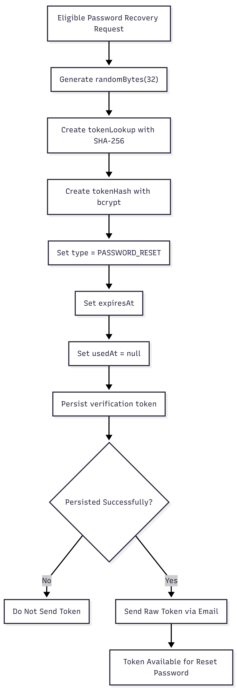

# FR-AUTH-011

Feature ID: AUTH-004
Module: AUTH
Priority: Must Have
Requirement Name: Generate Password Reset Token
Requirement Type: System
Status: Implemented
Version: MVP

# FR-AUTH-011 — Generate Password Reset Token

## Requirement Information

| Item | Value |
| --- | --- |
| **Requirement ID** | FR-AUTH-011 |
| **Feature ID** | AUTH-004 |
| **Module** | Authentication |
| **Requirement Name** | Generate Password Reset Token |
| **Requirement Type** | System Requirement |
| **Priority** | Must Have |
| **Version** | MVP |
| **Status** | Implemented |

## Overview

This requirement defines the system mechanism for generating a secure password reset token after a customer requests password recovery.

The token acts as a temporary credential that authorizes the password reset process and must have a defined expiration time and usage state.

## Description

The system shall generate a password reset token using a cryptographically secure random value.

The raw token shall be provided only to the password reset email delivery process, while the database shall store secure representations of the token for lookup and verification.

Each password reset token shall have an expiration time and usage state.

A token that has been used, expired, or replaced by a newer reset token must not be accepted.

## Actors

| Actor | Role |
| --- | --- |
| **System** | Generates, stores, rotates, and manages password reset tokens. |
| **Customer** | Receives the reset token through email and uses it to reset the password. |

## Preconditions

- The customer has submitted a password recovery request.
- The system has identified an eligible user account.
- The system can access the database.
- The system can generate cryptographically secure random values.

## Trigger

The system identifies a user account that can proceed with password recovery after a Forgot Password request.

## Main Flow

1. The system receives the password recovery request.
2. The system identifies the user associated with the submitted email address.
3. The system generates a cryptographically secure random password reset token.
4. The system derives `tokenLookup` from the raw token using SHA-256.
5. The system generates `tokenHash` from the raw token using the configured secure hashing mechanism.
6. The system determines the token expiration time.
7. The system creates a `PASSWORD_RESET` verification token record.
8. The system associates the token with the user's `userId`.
9. The system sets `usedAt` to `null`.
10. The system persists the token in the database.
11. The system provides the raw token to the password reset email delivery process.
12. The system sends or initiates the password reset email.
13. The token remains valid until it expires, is used, or is replaced by a newer password reset token.

## Alternative Flow

### A1 — New Password Reset Request

- The system generates a new password reset token.
- Any previously active password reset token for the user is rotated or invalidated according to the token rotation implementation.
- The new token becomes the valid credential for the next reset attempt.

### A2 — Token Generation Failure

- The system cannot generate the required secure random value.
- No valid reset token is created.
- The password recovery process cannot continue.
- The system records the failure according to its error-handling policy.

### A3 — Token Persistence Failure

- The system generates a token but cannot persist it to the database.
- The token must not be treated as valid.
- The raw token must not be sent to the customer.
- The system handles the database error according to the application error-handling policy.

## Postconditions

### If Successful

- A password reset token exists in the database.
- The token is associated with the correct user.
- The token type is `PASSWORD_RESET`.
- The token has a future expiration time.
- `usedAt` is `null`.
- The database contains secure token representations.
- The raw token is available only to the password reset email delivery process.
- The token can be used by the Reset Password flow.

### If Failed

- No valid password reset token is available.
- The user's password remains unchanged.
- An invalid or unpersisted token is not sent to the customer.

## Business Rules

| Rule ID | Rule |
| --- | --- |
| **BR-AUTH-063** | Password reset tokens must be generated using a cryptographically secure random value. |
| **BR-AUTH-064** | Password reset tokens must be practically unguessable. |
| **BR-AUTH-065** | Raw password reset tokens must not be stored directly in the database. |
| **BR-AUTH-066** | Password reset credentials must be stored using secure representations. |
| **BR-AUTH-067** | Every password reset token must have an expiration time. |
| **BR-AUTH-068** | A password reset token that has been used must not be accepted again. |
| **BR-AUTH-069** | A newer password reset request may invalidate or replace a previously active password reset token. |
| **BR-AUTH-070** | A password reset token may only authorize password recovery for its associated user. |
| **BR-AUTH-071** | A reset token that has expired must not be accepted. |
| **BR-AUTH-072** | A token that has not been successfully persisted must not be distributed to the customer. |

## Validation Rules

| Field | Validation |
| --- | --- |
| **Raw Token** | Must be generated from a cryptographically secure random source. |
| **Token Lookup** | Must be deterministically derived from the raw token using SHA-256. |
| **Token Hash** | Must be a secure hash of the raw token. |
| **User ID** | Must reference an existing eligible user. |
| **Expiration** | `expiresAt` must be in the future. |
| **Used Status** | A newly created token must have `usedAt = null`. |
| **Token Type** | Must be `PASSWORD_RESET`. |

## Acceptance Criteria

- The system can generate a password reset token.
- The token is generated using a cryptographically secure random source.
- The generated token is practically unguessable.
- The raw token is not stored directly in the database.
- A `tokenLookup` value is generated from the raw token.
- A `tokenHash` value is generated from the raw token.
- The token type is `PASSWORD_RESET`.
- The token has an `expiresAt` value.
- A new token has `usedAt = null`.
- The token is associated with the correct user.
- A new password recovery request can replace the previously active password reset token.
- An expired token cannot be used for password reset.
- A used token cannot be used again.
- A token that was not successfully persisted is not sent to the customer.

## Related Features

- **AUTH-004 — Forgot Password Request**
- **AUTH-005 — Reset Password**

## Related Functional Requirements

- **FR-AUTH-010 — Forgot Password Request**
- **FR-AUTH-012 — Reset Password**

## Related Database Tables

- `users`
- `verification_tokens`

## Related API Endpoints

| Method | Endpoint |
| --- | --- |
| **POST** | `/auth/forgot-password` |
| **POST** | `/auth/reset-password` |

## UI Reference

- Forgot Password Page
- Password Reset Email
- Reset Password Page

## Notes

- The implementation uses `randomBytes(32)` to generate the raw password reset token.
- `tokenLookup` is derived using SHA-256.
- `tokenHash` is generated using bcrypt according to the current implementation.
- The default password reset token TTL in the current MVP implementation is **1 hour**.
- Used tokens are marked using `usedAt`.
- A newer password reset request rotates the previously active reset token.
- The raw reset token is only used to construct the password reset URL and must not be persisted directly.

## Password Reset Token Flow

