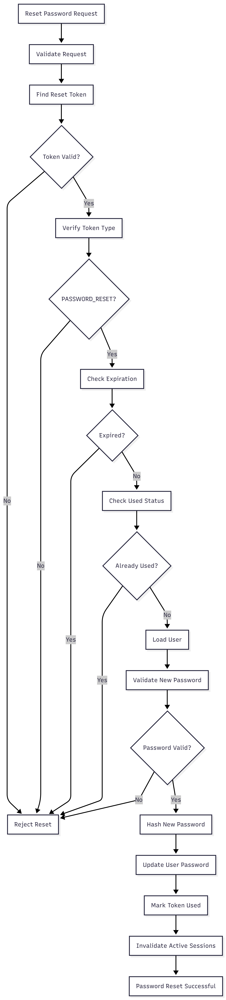

# FR-AUTH-012

Feature ID: AUTH-005
Module: AUTH
Priority: Must Have
Requirement Name: Reset Password
Requirement Type: User
Status: Implemented
Version: MVP

# FR-AUTH-012 — Reset Password

## Requirement Information

| Item | Value |
| --- | --- |
| **Requirement ID** | FR-AUTH-012 |
| **Feature ID** | AUTH-005 |
| **Module** | Authentication |
| **Requirement Name** | Reset Password |
| **Requirement Type** | User Requirement |
| **Priority** | Must Have |
| **Version** | MVP |
| **Status** | Implemented |

## Overview

This requirement defines the process of resetting a user's password using a valid password reset token.

The customer can set a new password after the supplied password reset credential has been successfully validated.

## Description

The system shall provide a password reset mechanism that allows a customer to set a new password using a valid, unexpired, and unused `PASSWORD_RESET` token.

The system shall validate the reset credential, verify the associated user, validate the new password, securely hash the new password, update the user's password, mark the reset credential as used, and invalidate active authentication sessions associated with the user.

## Actors

| Actor | Role |
| --- | --- |
| **Customer** | Provides the password reset token and submits a new password. |
| **System** | Validates the reset credential and updates the user's password securely. |

## Preconditions

- The customer has requested password recovery.
- A password reset token has been generated.
- The password reset token has type `PASSWORD_RESET`.
- The token has not expired.
- The token has not been used.
- The associated user exists.
- The system can access the database.

## Trigger

The customer submits the **Reset Password** form containing a valid password reset token and new password.

## Main Flow

1. The customer opens the Reset Password page.
2. The system receives the password reset token.
3. The customer enters:
    - New password
    - Password confirmation
4. The customer submits the Reset Password form.
5. The system validates the request data.
6. The system locates the password reset token.
7. The system validates the token credential.
8. The system verifies that the token type is `PASSWORD_RESET`.
9. The system verifies that the token has not expired.
10. The system verifies that the token has not been used.
11. The system retrieves the associated user.
12. The system verifies that the new password and confirmation password match.
13. The system hashes the new password using the configured secure password hashing mechanism.
14. The system updates the user's password hash.
15. The system marks the password reset token as used.
16. The system invalidates active authentication sessions associated with the user.
17. The system returns a successful password reset response.
18. The customer can log in using the new password.

## Alternative Flow

### A1 — Invalid Password Reset Token

- The system cannot locate a valid password reset token matching the supplied credential.
- Password reset is rejected.
- The user's password is not changed.
- The system returns an appropriate error response.

### A2 — Expired Password Reset Token

- The system determines that `expiresAt` has passed.
- Password reset is rejected.
- The user's password is not changed.
- The customer must request password recovery again.

### A3 — Password Reset Token Already Used

- The system determines that `usedAt` is already populated.
- Password reset is rejected.
- The token cannot be used again.
- The user's password is not changed.

### A4 — Password Confirmation Does Not Match

- The new password and confirmation password differ.
- Password reset is rejected.
- The user's password remains unchanged.

Example:

```
Password confirmation does not match.
```

### A5 — Associated User Not Found

- The password reset token exists.
- The associated user cannot be found.
- Password reset is rejected.
- The user's password is not changed.

### A6 — New Password Fails Validation

- The submitted new password does not satisfy the required password rules.
- Password reset is rejected.
- The user's password remains unchanged.

### A7 — Password Update Fails

- The system cannot persist the new password.
- The password reset operation fails.
- The reset token must not be treated as successfully consumed.
- No successful password reset response is returned.

### A8 — Session Invalidation Fails

- The new password has been updated successfully.
- The system cannot complete session invalidation.
- The implementation must handle the failure according to the authentication security policy and must not leave the account in an ambiguously reported state.

## Postconditions

### If Successful

- The user's password hash has been updated.
- The new password is securely stored.
- The password reset token is marked as used.
- The token cannot be reused.
- Active authentication sessions associated with the user are invalidated.
- The old password can no longer be used to authenticate.
- The customer can log in using the new password.

### If Failed

- The user's password remains unchanged.
- No successful password reset is reported.
- Invalid or expired reset credentials cannot be used to bypass validation.
- No new authentication session is created.

## Business Rules

| Rule ID | Rule |
| --- | --- |
| **BR-AUTH-071** | Password reset can only be performed using a valid password reset token. |
| **BR-AUTH-072** | A password reset token can only be used once. |
| **BR-AUTH-073** | An expired password reset token must not be accepted. |
| **BR-AUTH-074** | The new password and confirmation password must match. |
| **BR-AUTH-075** | The new password must be stored as a secure password hash. |
| **BR-AUTH-076** | A successfully consumed password reset token must be marked as used. |
| **BR-AUTH-077** | Active authentication sessions must be invalidated after a successful password reset. |
| **BR-AUTH-078** | The new password must never be returned through the API response. |
| **BR-AUTH-079** | A password reset token must be associated with the user whose password is being changed. |

## Validation Rules

| Field | Validation |
| --- | --- |
| **Token** | Required and must be valid. |
| **Token Type** | Must be `PASSWORD_RESET`. |
| **Token Expiration** | `expiresAt` must be greater than the current time. |
| **Token Usage** | `usedAt` must be `null`. |
| **New Password** | Required; minimum 8 characters. |
| **Confirm Password** | Required and must match the new password. |
| **User** | Associated user must exist. |

## Acceptance Criteria

- A customer can reset their password using a valid password reset token.
- An invalid token is rejected.
- An expired token is rejected.
- A previously used token is rejected.
- A token with the wrong type is rejected.
- A missing associated user is rejected.
- A new password shorter than 8 characters is rejected.
- A password confirmation mismatch is rejected.
- The new password is stored as a secure hash.
- The password reset token is marked as used after successful reset.
- The same password reset token cannot be used for a second reset.
- Active authentication sessions are invalidated after a successful password reset.
- The old password can no longer be used after a successful password reset.
- The customer can log in using the new password.
- The new password and password hash are not returned in the API response.

## Related Features

- **AUTH-004 — Forgot Password Request**
- **AUTH-005 — Reset Password**

## Related Functional Requirements

- **FR-AUTH-010 — Forgot Password Request**
- **FR-AUTH-011 — Generate Password Reset Token**
- **FR-AUTH-003 — User Login**
- **FR-AUTH-009 — Destroy User Session**

## Related Database Tables

- `users`
- `verification_tokens`
- `sessions`

## Related API Endpoints

| Method | Endpoint |
| --- | --- |
| **POST** | `/auth/reset-password` |
| **POST** | `/auth/login` |

## UI Reference

- Reset Password Page
- Password Reset Success State
- Password Reset Failed State
- Login Page

## Notes

- The new password must be hashed using the password hashing mechanism implemented by the system.
- Raw password reset tokens are not stored in the database.
- A successfully consumed token is marked using `usedAt`.
- Password reset tokens cannot be reused after successful consumption.
- Active sessions are invalidated after a successful password reset.
- The customer must authenticate again after the password reset.
- The old password must no longer authenticate successfully after the password has been changed.
- The password reset operation must not return the new password or password hash.

## Password Reset Flow

