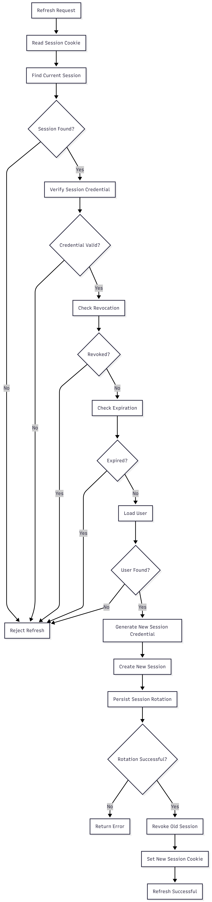

# FR-AUTH-013

Feature ID: AUTH-006
Module: AUTH
Priority: Must Have
Requirement Name: Refresh Access Token
Requirement Type: System
Status: Implemented
Version: MVP

# FR-AUTH-013 — Refresh Access Token

## Requirement Information

| Item | Value |
| --- | --- |
| **Requirement ID** | FR-AUTH-013 |
| **Feature ID** | AUTH-006 |
| **Module** | Authentication |
| **Requirement Name** | Refresh Access Token |
| **Requirement Type** | System Requirement |
| **Priority** | Must Have |
| **Version** | MVP |
| **Status** | Implemented |

## Overview

This requirement defines the mechanism used by Ruma to maintain an authenticated user session by rotating an active session before it becomes invalid.

The system shall allow an eligible active session to be replaced with a new session without requiring the customer to provide their email address and password again.

## Description

Ruma uses **session-based authentication** rather than JWT access tokens and refresh tokens.

When a customer requests a session refresh, the system shall validate the current session, ensure that it has not been revoked or expired, create a replacement session for the same user, revoke the previous session, and provide the new session credential through the authentication cookie.

The previous session must not be usable after successful rotation.

## Actors

| Actor | Role |
| --- | --- |
| **Customer** | Requests a session refresh while continuing to use the application. |
| **System** | Validates the current session, creates the replacement session, revokes the previous session, and updates the authentication cookie. |

## Preconditions

- The customer has previously authenticated successfully.
- An authentication session exists.
- The session credential is available through the authentication cookie.
- The session has not been revoked.
- The session has not expired.
- The associated user still exists.
- The system can access the database.

## Trigger

The client sends a session refresh request while the current authentication session is eligible for rotation.

## Main Flow

1. The client sends a refresh request.
2. The system reads the current session credential from the authentication cookie.
3. The system derives the session lookup value from the credential.
4. The system locates the corresponding session.
5. The system validates the session credential.
6. The system verifies that the session has not been revoked.
7. The system verifies that the session has not expired.
8. The system retrieves the user associated with the session.
9. The system generates a new cryptographically secure session credential.
10. The system derives the lookup value for the new credential.
11. The system securely hashes the new credential.
12. The system creates a new session associated with the same user.
13. The system assigns the new session expiration time.
14. The system revokes the previous session.
15. The system persists the session rotation.
16. The system replaces the authentication cookie with the new session credential.
17. The system returns a successful refresh response.
18. The customer continues using the application without entering their password again.

## Alternative Flow

### A1 — Session Not Found

- The system cannot locate a session corresponding to the supplied credential.
- Session refresh is rejected.
- No replacement session is created.
- The customer must authenticate again.

### A2 — Session Expired

- The system finds the session.
- `expiresAt` has passed.
- The system rejects the refresh request.
- The expired session is not reactivated.
- The customer must authenticate again.

### A3 — Session Revoked

- The system finds the session.
- `revokedAt` is not `null`.
- The system rejects the refresh request.
- The revoked session is not reactivated.
- No replacement session is created.

### A4 — User Not Found

- The current session is found.
- The associated user cannot be found.
- The system rejects the refresh request.
- No replacement session is created.

### A5 — Session Credential Invalid

- The session lookup succeeds.
- The supplied credential does not match the stored session credential hash.
- The system rejects the refresh request.
- No replacement session is created.

### A6 — Session Rotation Fails

- The system cannot create or persist the replacement session.
- The replacement session is not considered valid.
- The old session must not be considered successfully rotated.
- The system returns an appropriate error response.

## Postconditions

### If Successful

- A new session exists for the same user.
- The new session has a new expiration time.
- The new session credential is provided through the authentication cookie.
- The previous session is revoked.
- The previous session credential cannot be used for authenticated requests.
- The customer remains authenticated without re-entering their password.

### If Failed

- No valid replacement session is provided.
- The previous revoked session is never reactivated.
- The customer may need to log in again.

## Business Rules

| Rule ID | Rule |
| --- | --- |
| **BR-AUTH-079** | Session refresh can only be performed using an eligible active session. |
| **BR-AUTH-080** | A revoked session must not be refreshed. |
| **BR-AUTH-081** | An expired session must not be used to establish a replacement session. |
| **BR-AUTH-082** | A new session credential must be generated using a cryptographically secure random value. |
| **BR-AUTH-083** | Raw session credentials must not be stored in the database. |
| **BR-AUTH-084** | A replacement session must have a defined expiration time. |
| **BR-AUTH-085** | The previous session must be revoked when session rotation succeeds. |
| **BR-AUTH-086** | The previous session credential must not remain usable after successful rotation. |
| **BR-AUTH-087** | Session refresh must not create a new user or modify the user's account identity. |
| **BR-AUTH-088** | The replacement session must belong to the same user as the previous session. |
| **BR-AUTH-089** | A failed session rotation must not result in an unusable replacement credential being issued to the client. |

## Validation Rules

| Field | Validation |
| --- | --- |
| **Session Cookie** | Must be present for a refresh request. |
| **Session Credential** | Must correspond to an existing session and pass credential verification. |
| **Session Revocation** | `revokedAt` must be `null`. |
| **Session Expiration** | `expiresAt` must be greater than the current time. |
| **User** | The user associated with the session must exist. |
| **New Session** | Must use a newly generated credential and expiration time. |

## Acceptance Criteria

- A customer with an eligible session can perform a session refresh.
- The system validates the current session before rotation.
- A new session credential is generated.
- The new session belongs to the same user as the old session.
- The new session has a new expiration time.
- The raw new session credential is not stored in the database.
- The new credential is provided through the authentication cookie.
- The previous session is revoked after successful rotation.
- The previous session cannot be used after successful rotation.
- A revoked session cannot be refreshed.
- An expired session cannot be refreshed.
- An invalid session credential cannot be refreshed.
- A missing user prevents session refresh.
- The customer remains authenticated after successful rotation.
- The customer does not need to re-enter their password when session refresh succeeds.

## Related Features

- **AUTH-002 — User Login**
- **AUTH-006 — Session Refresh**
- **AUTH-007 — Change Password**

## Related Functional Requirements

- **FR-AUTH-005 — Authenticate User Session**
- **FR-AUTH-006 — Maintain User Authentication**
- **FR-AUTH-007 — Establish User Session**
- **FR-AUTH-009 — Destroy User Session**

## Related Database Tables

- `users`
- `sessions`

## Related API Endpoints

| Method | Endpoint |
| --- | --- |
| **POST** | `/auth/refresh` |
| **GET** | `/auth/me` |

## UI Reference

- Authenticated User Page
- Session Refresh State
- Session Expired / Login Page
- Unauthorized State

## Notes

- Ruma uses session-based authentication and does not use JWT access tokens or JWT refresh tokens.
- The requirement name **Refresh Access Token** is retained to remain consistent with the Master Feature List.
- In the current implementation, the underlying behavior is **session rotation**.
- The old session is revoked after the replacement session is successfully established.
- The replacement session is associated with the same user.
- Raw session credentials must not be persisted in the database.
- A revoked or expired session must never be reactivated through refresh.

## Session Rotation Flow

