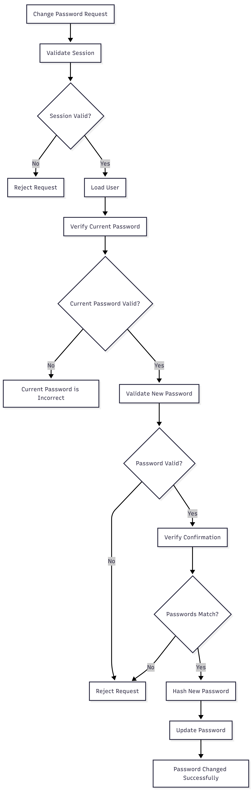

# FR-AUTH-014

Feature ID: AUTH-007
Module: AUTH
Priority: Should Have
Requirement Name: Change Password
Requirement Type: User
Status: Implemented
Version: MVP

# FR-AUTH-014 — Change Password

### Requirement Information

| Item | Value |
| --- | --- |
| **Requirement ID** | FR-AUTH-014 |
| **Feature ID** | AUTH-007 |
| **Module** | Authentication |
| **Requirement Name** | Change Password |
| **Requirement Type** | User Requirement |
| **Priority** | Should Have |
| **Version** | MVP |
| **Status** | Implemented |

## Overview

This requirement defines the process that allows an authenticated customer to change their current password.

The customer must provide their current password and a valid new password before the system updates the account credentials.

## Description

The system shall allow an authenticated customer to change their password without using the password recovery flow.

The system shall verify the customer's current password, validate the new password and confirmation password, securely hash the new password, and update the user's password credential.

The system must reject the operation when the current password is incorrect.

## Actors

| Actor | Role |
| --- | --- |
| **Customer** | Provides the current password and new password. |
| **System** | Authenticates the request, validates the current password, and updates the stored password hash. |

## Preconditions

- The customer is authenticated.
- The customer's authentication session is valid.
- The associated user account exists.
- The system can access the database.
- The customer knows their current password.

## Trigger

The customer submits the **Change Password** form.

## Main Flow

1. The customer opens the Change Password page.
2. The system verifies that the customer has a valid authenticated session.
3. The customer enters:
    - Current password
    - New password
    - Confirm new password
4. The customer submits the form.
5. The system validates the request.
6. The system retrieves the authenticated user's account.
7. The system verifies the current password against the stored password hash.
8. The system validates the new password.
9. The system verifies that the new password and confirmation password match.
10. The system hashes the new password using the configured secure password hashing mechanism.
11. The system updates the user's password hash.
12. The system completes the password change operation.
13. The system returns a successful response.

## Alternative Flow

### A1 — Authentication Required

- The customer does not have a valid authentication session.
- The system rejects the request.
- The password is not changed.

Example:

```
Authentication required.
```

### A2 — Current Password Incorrect

- The system retrieves the authenticated user's account.
- The submitted current password does not match the stored password hash.
- The system rejects the request.
- The password is not changed.

Example:

```
Current password is incorrect.
```

### A3 — Password Confirmation Does Not Match

- The new password and confirmation password are different.
- The system rejects the request.
- The current password remains unchanged.

### A4 — New Password Fails Validation

- The new password does not satisfy the configured password requirements.
- The system rejects the request.
- The current password remains unchanged.

### A5 — User Not Found

- The authenticated session references a user that is no longer available.
- The system rejects the request.
- The password is not changed.

### A6 — Password Update Fails

- The system cannot persist the new password.
- The system returns an appropriate error.
- The existing password remains unchanged.

## Postconditions

### If Successful

- The user's password hash is updated.
- The previous password is no longer valid.
- The new password can be used for subsequent authentication.
- No plain-text password is stored.
- The system returns a successful response.

### If Failed

- The user's password remains unchanged.
- No new password credential is activated.
- The existing authenticated session remains subject to the authentication policy.

## Business Rules

| Rule ID | Rule |
| --- | --- |
| **BR-AUTH-090** | Change password requires an authenticated user session. |
| **BR-AUTH-091** | The current password must be verified before the new password is accepted. |
| **BR-AUTH-092** | The new password must satisfy the configured password requirements. |
| **BR-AUTH-093** | The new password and confirmation password must match. |
| **BR-AUTH-094** | The new password must be stored as a secure password hash. |
| **BR-AUTH-095** | An incorrect current password must not modify the user's password. |
| **BR-AUTH-096** | Passwords must never be returned through the API response. |
| **BR-AUTH-097** | A successful password change must make the new password available for future authentication. |

## Validation Rules

| Field | Validation |
| --- | --- |
| **Current Password** | Required. |
| **New Password** | Required; minimum 8 characters. |
| **Confirm Password** | Required and must match the new password. |
| **Authentication Session** | Must be valid and associated with an existing user. |

## Acceptance Criteria

- An authenticated customer can change their password.
- An unauthenticated request is rejected.
- A valid current password allows the password change to continue.
- An incorrect current password is rejected.
- The new password must contain at least 8 characters.
- A password confirmation mismatch is rejected.
- The new password is securely hashed before storage.
- The password hash is updated after successful password change.
- The old password can no longer be used after successful password change.
- The new password can be used to log in successfully.
- The API does not return the password or password hash.
- A failed password change does not modify the existing password.

## Related Features

- **AUTH-007 — Change Password**
- **AUTH-002 — User Login**
- **AUTH-003 — User Logout**

## Related Functional Requirements

- **FR-AUTH-003 — User Login**
- **FR-AUTH-004 — Credential Validation**
- **FR-AUTH-005 — Authenticate User Session**

## Related Database Tables

- `users`
- `sessions`

## Related API Endpoints

| Method | Endpoint |
| --- | --- |
| **POST** | `/auth/change-password` |
| **POST** | `/auth/login` |

## UI Reference

- Change Password Page
- Current Password Error State
- Validation Error State
- Password Change Success State

## Notes

- The customer must be authenticated before changing their password.
- The current password must be verified before updating the password.
- The new password must not be returned through the API.
- The password is stored using the configured secure hashing mechanism.
- Password change is different from password reset because it requires the customer's current password and an authenticated session.
- The exact session invalidation behavior after password change must follow the implemented authentication policy.

## Change Password Flow

