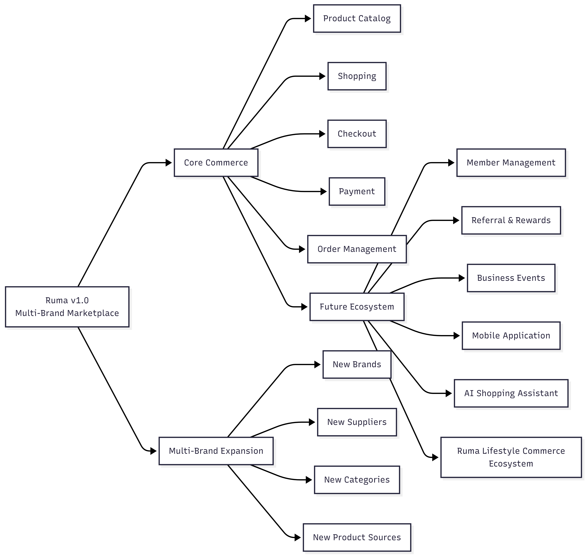

# Vision

# Project Information

| Item | Value |
| --- | --- |
| **Project** | Ruma |
| **Document Type** | Vision Document |
| **Version** | 2.0 |
| **Status** | Draft |
| **Author** | Naufal Faiq Azryan |
| **Role** | Full Stack Software Engineer |
| **Repository** | - |
| **Start Date** | 04 August 2026 |
| **Last Updated** | 27 August 2026 |

# Purpose

This Vision Document provides the strategic direction for the development of **Ruma**.

It defines the project's background, problems to be addressed, product vision, business goals, stakeholders, initial scope, and long-term direction.

This document serves as a high-level reference for analysis, product planning, system design, implementation, and future development to ensure that Ruma evolves consistently with its business vision.

# **Project Overview**

**Ruma** is a multi-brand lifestyle marketplace designed to make everyday shopping more convenient by bringing products from diverse brands, suppliers, and categories into a single digital platform.

Ruma provides a scalable foundation that allows new brands, suppliers, categories, and products to be introduced without requiring fundamental changes to the marketplace system.

The platform initially focuses on household, kitchen, lifestyle, and selected local products, while remaining open to future product expansion.

# Background

The initial business environment presents several challenges:

- Product purchases are often handled through personal chats or WhatsApp.
- Product information is not centralized.
- Customers may have difficulty discovering available products and suppliers.
- Payment verification may require manual processing.
- Order status and delivery tracking are not centralized.
- Product, inventory, and transaction management can become increasingly difficult as the catalog grows.

These challenges create an opportunity to establish a centralized digital commerce platform that can support both current and future product offerings.

# Problem Statement

Ruma aims to address the following problems:

- Shopping processes are inconvenient and fragmented.
- Product information is not centralized.
- Product and inventory availability can be difficult to monitor.
- Administrative operations involve repetitive manual processes.
- Customers lack centralized transaction and order history.
- Adding new brands or products should not require major changes to the marketplace system.

# Vision Statement

> **To become a trusted and scalable lifestyle marketplace that connects customers with diverse products, brands, and suppliers through a convenient, transparent, and integrated digital shopping experience.**
> 

This vision positions Ruma as a **platform**, rather than a marketplace limited to a single brand.

# Project Goals

## Short-Term Goals

- Establish the Ruma multi-brand marketplace.
- Provide centralized product discovery.
- Provide customer authentication and account management.
- Provide shopping cart and checkout functionality.
- Integrate online payment methods.
- Provide order management and tracking.
- Provide product and inventory management.
- Provide administrative management and reporting.

## Future Goals

- Expand supported brands and suppliers.
- Expand product categories.
- Introduce member management.
- Introduce referral and reward programs.
- Support business events such as BOS.
- Introduce mobile applications.
- Introduce AI-powered shopping assistance.
- Expand Ruma into a broader lifestyle commerce ecosystem.

# Stakeholders

1. **Customer**
2. **Member**
3. **Administrator**
4. **Warehouse / Fulfillment**
5. **Finance**
6. **Owner / Business Management**
7. **Supplier / Brand Partner**

# Scope

## Ruma v1.0

### User Management

### **User Management**

#### Customer

- Email registration
- Login
- Logout
- Email verification
- Password recovery
- Profile management
- Profile photo
- Password change
- Multiple shipping addresses
- Default shipping address

#### Administrator

- Admin authentication
- Role management
- Permission management
- Activity logging

### Product Management

- Product catalog
- Product categories
- Product subcategories
- Brand management
- Supplier management
- Product details
- Product images
- Product videos
- Product descriptions
- Product specifications
- Product variants
- Product colors
- Product status
- Product stock
- SKU
- Product weight
- Product dimensions

**Important:** The product catalog is not limited to Moorlife or any predefined brand.

### Search & Discovery

- Product search
- Search by product name
- Category filtering
- Brand filtering
- Supplier filtering
- Price filtering
- Sorting
- New products
- Best-selling products
- Recommended products

### Shopping Cart

- Add products to cart
- Remove products
- Update quantity
- Select products
- Apply vouchers
- Calculate shipping cost
- Shopping summary

### Checkout

- Select shipping address
- Select courier
- Select shipping service
- Select payment method
- Order summary
- Checkout confirmation

### Payment

- QRIS
- Virtual Account
- Bank Transfer
- Payment gateway integration
- Payment status
- Payment callback
- Invoice

### Order Management

#### Customer

- View order history
- View order details
- Track order status
- Cancel order before processing
- Confirm order receipt

#### Administrator

- View orders
- Update order status
- Manage order processing
- Generate invoices

### Shipping

- Courier integration
- Shipping cost calculation
- Tracking number
- Shipment tracking

### Review & Rating

Customers can:

- Give ratings
- Write reviews
- Upload review photos

### Wishlist

- Add products to wishlist
- Remove products from wishlist
- Move products to cart

### Promotion

- Promotional banners
- Vouchers
- Product discounts
- Flash sales
- Promotional campaigns

### Notification

- Email notifications
- WhatsApp notifications *(optional)*
- Order status notifications

### Administration Dashboard

- Total sales
- Total orders
- Best-selling products
- New customers
- Revenue
- Daily statistics
- Sales charts

### Product Administration

Administrators can:

- Create, update, and delete products
- Manage brands
- Manage suppliers
- Manage categories
- Upload product images
- Manage inventory
- Manage pricing
- Manage promotional banners

### Reporting

- Sales reports
- Product reports
- Customer reports
- Excel export
- PDF export

# Out of Scope

The following features are outside the scope of Ruma v1.0:

- Mobile application
- AI assistant
- Live shopping
- Live streaming
- Video commerce
- Multi-vendor marketplace
- Multi-warehouse
- Affiliate system
- Member commission
- Event BOS
- Loyalty points
- Gamification
- Subscription
- Customer service chat
- Return & refund management
- ERP integration
- Accounting integration
- Multi-language
- Multi-currency
- Offline POS
- Business intelligence

# Long Term Vision

## Long-Term Vision Statement

> **Ruma aims to evolve from a multi-brand marketplace into a broader lifestyle commerce ecosystem that connects customers, brands, suppliers, and business partners through an integrated digital platform.**
> 

# Guiding Principles

### 1. Scalability

Ruma must support the addition of new brands, suppliers, categories, and products without requiring fundamental changes to the marketplace architecture.

### 2. Customer-Centric Experience

The platform should make product discovery, purchasing, payment, and order tracking simple and convenient.

### 3. Multi-Brand by Design

Ruma should not be structurally dependent on a single brand or product category.

### 4. Operational Efficiency

The platform should reduce repetitive manual processes and centralize business operations.

### 5. Extensibility

The system should provide a foundation for future capabilities such as member management, rewards, mobile applications, and AI-powered services.